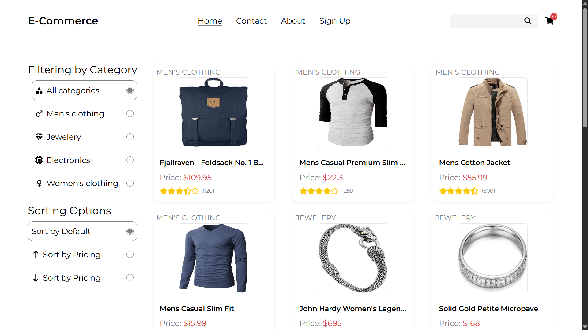

# React E-Commerce Showcase

A feature-rich, full-stack e-commerce web application built from the ground up with modern web technologies. This project demonstrates a comprehensive understanding of front-end development with React, state management with the Context API, and backend integration using Firebase for user authentication and data persistence.

**Live Demo:** [E-Commerce-App](https://e-commerce-app-six-beige.vercel.app/)

## 

## Key Features

- **Dynamic Product Catalog:** Fetches and displays products from the FakeStoreAPI, complete with dynamic sorting and filtering capabilities.
- **User Authentication:** Secure sign-up and login system powered by **Firebase Authentication**.
- **Persistent Shopping Cart:** The user's cart is saved to their account in a **Cloud Firestore** database, allowing it to persist across sessions and devices.
- **Complete Account Management:** A dedicated account page where users can view and update their profile information (name, email) and securely change their password.
- **Product Rating System:** Logged-in users can rate products, and their ratings are saved and displayed.
- **Responsive Design:** A mobile-first design that ensures a seamless user experience across all device sizes, from mobile phones to desktops.
- **Simulated Checkout:** A complete user flow from adding to cart to a final order confirmation page.

---

## Technology Stack

This project was built using a modern and robust tech stack:

- **Front-End:**
  - **React:** For building the core user interface.
  - **React Router:** For all client-side routing and navigation.
  - **Tailwind CSS:** For styling and creating a responsive design.
- **State Management:**
  - **React Context API:** Used extensively to manage global state for products, user sessions, cart data, and product details in a clean, organized manner.
- **Back-End & Database:**
  - **Firebase Authentication:** Handles all user sign-up, login, and account management.
  - **Cloud Firestore:** Used as the NoSQL database to store user profiles, shopping carts, and product ratings.
- **External APIs & Services:**
  - **FakeStoreAPI:** Provides the initial product data for the catalog.
  - **EmailJS:** Powers the "Contact Us" form functionality.
- **Build Tool:**
  - **Vite:** For a fast and modern development environment.

---

## Getting Started

To get a local copy up and running, follow these simple steps.

### Prerequisites

You need to have Node.js and npm installed on your machine.

### Installation

1.  Clone the repository:
    ```sh
    git clone [https://github.com/alish-shady/e-commerce-app.git](https://github.com/alish-shady/e-commerce-app.git)
    ```
2.  Navigate to the project directory:
    ```sh
    cd e-commerce-app
    ```
3.  Install NPM packages:
    ```sh
    npm install
    ```
4.  Create a `.env.local` file in the root directory and add your Firebase and EmailJS configuration keys:
    ```
    VITE_API_KEY="YOUR_FIREBASE_API_KEY"
    VITE_AUTH_DOMAIN="YOUR_FIREBASE_AUTH_DOMAIN"
    # ... and so on for all Firebase and EmailJS keys
    ```
5.  Run the development server:
    ```sh
    npm run dev
    ```

---

## About the Developer

My name is **Ali Shapoori**, and I am a web developer passionate about creating clean, user-friendly, and powerful applications. This project was built to showcase my skills in front-end architecture, state management, and backend integration.

Feel free to get in touch!

- **Email:** [alishapoori83@gmail.com](mailto:alishapoori83@gmail.com)
- **GitHub:** [github.com/alish-shady](https://github.com/alish-shady)
